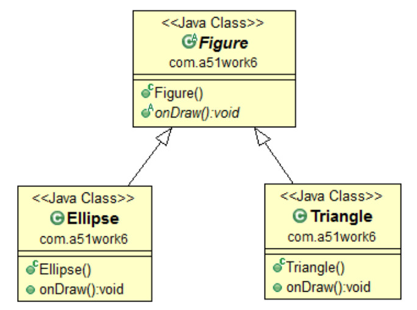

## 13.1 抽象类

Java语言提供了两种类：一种是具体类；另一种是抽象了。前面章节接触的类都是具体类。这一节介绍一下抽象类。

### 13.1.1 抽象类概念

在13.4.1节介绍多态时候，使用过几何图形类示例，其中Figure（几何图形）类中有一个onDraw（绘图）方法，Figure有两个子类Ellipse（椭圆形）和Triangle（三角形），Ellipse和Triangle覆盖onDraw方法。

作为父类Figure（几何图形）并不知道在实际使用时有多少个子类，目前有椭圆形和三角形，那么不同的用户需求可能会有矩形或圆形等其他几何图形，而onDraw方法只有确定是哪一个子类后才能具体实现。Figure中的onDraw方法不能具体实现，所以只能是一个抽象方法。在Java中具有抽象方法的类称为“抽象类”，Figure是抽象类，其中的onDraw方法是抽象方法。如图13-1所示类图中Figure是抽象类，Ellipse和Triangle是Figure子类实现Figure的抽象方法onDraw。



图13-1　抽象类几何图形类图

**提示 在UML类图抽象类和抽象方法字体是斜体的，见图13-1所示中的Figure类和onDraw方法都是斜体的。**

### 13.1.2 抽象类声明和实现

在Java中抽象类和抽象方法的修饰符是abstract，声明抽象类Figure示例代码如下：

```java
//Figure.java文件
package com.a51work6;

public abstract class Figure { ①
    // 绘制几何图形方法
    public abstract void onDraw(); ②
}
```

代码第①行是声明抽象类，在类前面加上abstract修饰符。代码第②行声明抽象方法，方法前面的修饰符也是abstract，注意抽象方法中只有方法的声明，没有方法的实现，即没有大括号（{}）部分。

**注意 如果一个方法被声明为抽象的，那么这个类也必须声明为抽象的。而一个抽象类中，可以有0~n个抽象方法，以及0~n具体方法。**

设计抽象方法目的就是让子类来实现的，否则抽象方法就没有任何意义，实现抽象类示例代码如下：


```java
//Ellipse.java文件
package com.a51work6;

//几何图形椭圆形
public class Ellipse extends Figure {		

	//绘制几何图形方法
	@Override
	public void onDraw() {
		System.out.println("绘制椭圆形...");
	}
}

//Triangle.java文件
package com.a51work6;

//几何图形三角形
public class Triangle extends Figure {

	// 绘制几何图形方法
	@Override
	public void onDraw() {
		System.out.println("绘制三角形...");
	}
}
```


上述代码声明了两个具体类Ellipse和Triangle，它们实现（覆盖）了抽象类Figure的抽象方法onDraw。

调用代码如下：


```java
//HelloWorld.java文件
package com.a51work6;

public class HelloWorld {

	public static void main(String[] args) {

		// f1变量是父类类型，指向子类实例，发生多态
		Figure f1 = new Triangle();
		f1.onDraw();

		// f2变量是父类类型，指向子类实例，发生多态
		Figure f2 = new Ellipse();
		f2.onDraw();
	}
}
```

上述代码中实例化两个具体类Triangle和Ellipse，对象f1和f2是Figure引用类型。

**注意 抽象类不能被实例化,只有具体类才能被实例化。**