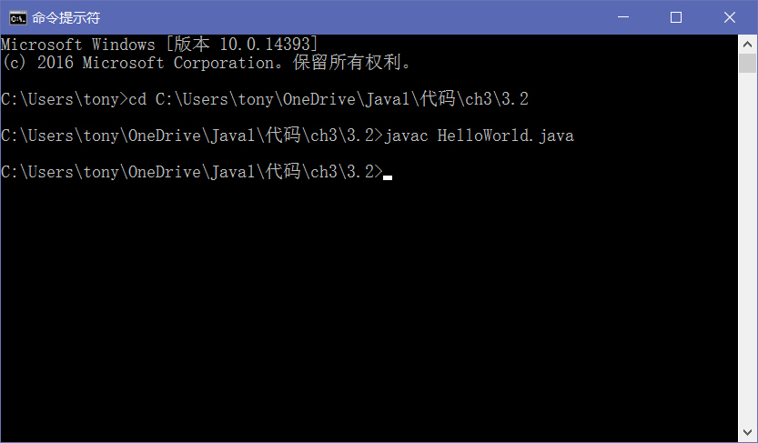
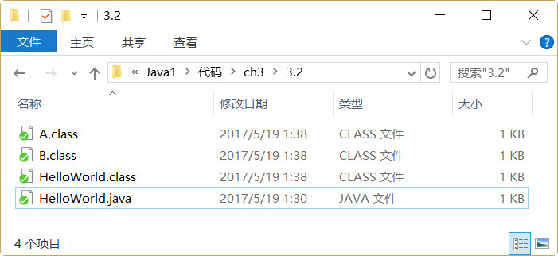
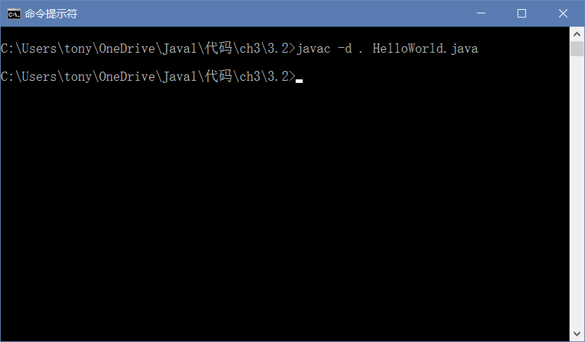
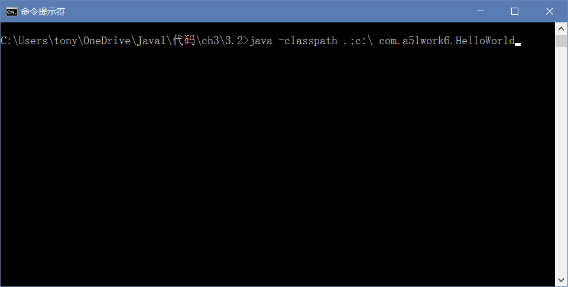

## 3.2 文本编辑工具+JDK实现 {#jdk}

如果不想使用IDE工具（笔者建议出学者通过这种方式学习Java），那么文本编辑工具+JDK对于初学者而言是一个不错的选择，这种方式可以使初学者了解到Java程序的编译和运行过程，通过自己在编辑器中敲入所有代码，可以帮助熟悉常用类和方法。

**注意 在2.3.3节介绍过EditPlus与JDK集成过程，2.3.3节集成方式有一个弊端是：不能执行带有包的Java应用程序。**

### 3.2.1 编写源代码文件

首先使用任何文本编辑工具创建一个文件，然后将文件保存为HelloWorld.java。接着在HelloWorld.java文件中编写如下代码：

```java
package com.a51work6;

public class HelloWorld {

	public static void main(String[] args) {	
		System.out.print("Hello World."); 
	}

}

```

在Java中一个源程序文件中可以定义多个类，如下代码定义了三个类HelloWorld、A和B。

```java
//HelloWorld.java源文件
package com.a51work6;

public class HelloWorld {
	public static void main(String[] args) {
		System.out.println("Hello World!");
	}
}

class A {
	
}

class B {
	
}
```

**注意 一个源程序文件包含多个类时，需要注意如下问题：
1\. 只能有一个类声明为公有（public）的。
2\. 文件命名必须与公有类名完全一致，包括字母大小写。
3\. public static void main(String[] args)只能定义在公有类中。**

### 3.2.2 编译程序 {#-0}

编译程序需要在命令行中使用JDK的javac指令编写，参考2.1.2节打开命令行，如图3-7所示，通过cd命令进入到源文件所在的目录，然后执行javac指令。如果没有错误提示，说明编译成功，编译成功则在当前目录下面生成类文件，如图3-8所示生成了三个类文件，这是因为HelloWorld.java源文件中定义了三个类。



图3-7 编译源文件



图3-8 编译成功

上述编译过程虽然成功了，但是运行时会有以下问题，这是由于HelloWorld.java源文件中定义了包com.a51work6，编译应该使用-d参数，编译指令如图3-9所示。



图3-9 编译有包的源文件

编译指令javac中的-d参数是指定类文件生成位置，-d后面跟的是一个目录的路径，本例中使用“.”点表示当前目录，编译成功之后的目录结果如下：

```
当前目录
│ HelloWorld.java
└─com
    └─a51work6
            A.class
            B.class
            HelloWorld.class

```

其中的com是目录，它在当前目录的子目录，a51work6也是目录，它是com的子目录，可以包com.a51work6会生成com\a51work6的目录结构。

### 3.2.3 运行程序 {#-1}

编译成功之后就可以运行了。执行类文件需要在命令行中使用JDK的java指令，参考2.1.2节打开命令行，如图3-10所示，通过cd命令进入到源文件所在的目录，然后执行java -classpath .;c:\com.a51work6.HelloWorld指令，执行成功在命令行窗口输出Hello World!字符串。



图3-10 运行类文件

**注意 java和javac指令都可以带有-classpath（缩写-cp），它用来指定类路径，即搜索类的路径，类似于操作系统中的path，路径之间用分号分隔，其中点（.）表示当前路径。就本例而言运行java程序HelloWorld所需要的全部类都在当前路径下，因此只需要设置-classpath .就可以了，或者省略（当前路径不用指定）。**