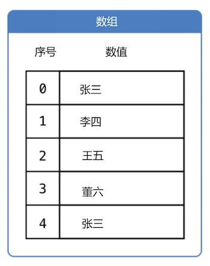

## 15.2 List集合

List集合中的元素是有序的，可以重复出现。图15-2是一个班级集合数组，这个集合中有一些学生，这些学生是有序的，顺序是他们被放到集合中的顺序，可以通过序号访问他们。这就像老师给进入班级的人分配学号，第一个报到的是“张三”，老师给他分配的是0，第二个报到的是“李四”，老师给他分配的是1，以此类推，最后一个序号应该是“学生人数-1”。


图15-2　数组集合

**提示 List集合关心的元素是否有序，而不关心是否重复，请大家记住这个原则。例如，图15-2所示的班级集合中就有两个“张三”。**

List接口的实现类有：ArrayList 和 LinkedList。ArrayList是基于动态数组数据结构的实现，LinkedList是基于链表数据结构的实现。ArrayList访问元素速优于LinkedList，LinkedList占用的内存空间比较大，但LinkedList在批量插入或删除数据时优于ArrayList。

不同的结构对应于不同的算法，有的考虑节省占用空间，有的考虑提高运行效率，对于程序员而言，它们就像是“熊掌”和“鱼肉”，不可兼得！提高运行速度往往是以牺牲空间为代价的，而节省占用空间往往是以牺牲运行速度为代价的。

### 15.2.1 常用方法

List接口继承自Collection接口，List接口中的很多方法都继承自Collection接口的。List接口中常用方法如下。

#####1.  操作元素

*   get(int index)：返回List集合中指定位置的元素。
*   set(int index, Object element)：用指定元素替换List集合中指定位置的元素。
*   add(Object element)：在List集合的尾部添加指定的元素。该方法是从Collection集合继承过了的。
*   add(int index, Object element)：在List集合的指定位置插入指定元素。
*   remove(int index)：移除List集合中指定位置的元素。
*   remove(Object element)：如果List集合中存在指定元素，则从List集合中移除第一次出现的指定元素。该方法是从Collection集合继承过了的。
*   clear()：从List集合中移除所有元素。该方法是从Collection集合继承过了的。

#####2.  判断元素

*   isEmpty()：判断List集合中是否有元素，没有返回true，有返回false。该方法是从Collection集合继承过了的。
*   contains(Object element)：判断List集合中是否包含指定元素，包含返回true，不包含返回false。该方法是从Collection集合继承过了的。

#####3.  查询元素

*   indexOf(Object o)：从前往后查找List集合元素，返回第一次出现指定元素的索引，如果此列表不包含该元素，则返回-1。
*   lastIndexOf(Object o)：从后往前查找List集合元素，返回第一次出现指定元素的索引，如果此列表不包含该元素，则返回-1。

#####4.  其他

*   iterator()：返回迭代器（Iterator）对象，迭代器对象用于遍历集合。该方法是从Collection集合继承下来的。
*   size()：返回List集合中的元素数，返回值是int类型。该方法是从Collection集合继承下来的。
*   subList(int fromIndex, int toIndex)：返回List集合中指定的 fromIndex（包括 ）和 toIndex（不包括）之间的元素集合，返回值List集合。

示例代码如下：

```java
//HelloWorld.java文件
package com.a51work6;

import java.util.ArrayList;
import java.util.List;

public class HelloWorld {

	public static void main(String[] args) {

		List list = new ArrayList(); ①

		String b = "B";
		
		//向集合中添加元素
		list.add("A");
		list.add(b);  ②
		list.add("C");
		list.add(b);  ③
		list.add("D");
		list.add("E");
		
		//打印集合元素个数
		System.out.println("集合size = " + list.size());
		//打印集合
		System.out.println(list);
		
		//从前往后查找集合中的"B"元素
		System.out.println("indexOf(\"B\") = " + list.indexOf(b));
		//从后往前查找集合中的"B"元素
		System.out.println("lastIndexOf(\"B\") = " + list.lastIndexOf(b));
		
		//删除集合中第一个"B"元素
		list.remove(b);		
		System.out.println("remove(3)前： " + list);
		//判断集合中是否包含"B"元素
		System.out.println("是否包含\"B\"：" + list.contains(b));	
		
		//删除集合第4个元素
		list.remove(3);
		System.out.println("remove(3)后： " + list);
		//判断集合是否为空
		System.out.println("list集合是空的：" + list.isEmpty());

		System.out.println("替换前：" + list);
		//替换集合第2个元素
		list.set(1, "F");
		System.out.println("替换后：" + list);
		
		//清空集合
		list.clear();	 ④
		System.out.println(list);


		// 重新添加元素
		list.add(1);//发生自动装箱 ⑤
		list.add(3);
			
		int item = (Integer)list.get(0);//发生自动拆箱 ⑥
	}
}
```

运行结果如下：

	集合size = 6
	[A, B, C, B, D, E]
	indexOf("B") = 1
	lastIndexOf("B") = 3
	remove(3)前： [A, C, B, D, E]
	是否包含"B"：true
	remove(3)后： [A, C, B, E]
	list集合是空的：false
	替换前：[A, C, B, E]
	替换后：[A, F, B, E]
	[]

代码第①行声明List类型集合变量list，使用ArrayList类实例化list，List是接口不能实例化。添加集合元素过程中可以添加重复的元素，见代码第②行和第③行。代码第④行list.clear()是清空集合，但需要注意的是变量list所引用的对象还是存在的，不是null，只是集合中没有了元素。

**提示 在Java中任何集合中存放的都是对象，即引用数据类型，基本数据类型不能放到集合中。但上述代码第⑤行却将整数1放到集合中，这是因为这个过程中发生了自动装箱，整数1被封装成Integer对象1，然后再放入到集合中。相反从集合中取出的也是对象，代码第⑥行从集合中取出的是Integer对象，之所以能够赋值给int类型，是因为这个过程发生了自动拆箱。**

### 15.2.2 遍历集合

集合最常用的操作之一是遍历，遍历就是将集合中的每一个元素取出来，进行操作或计算。List集合遍历有三种方法：

**1.  使用for循环遍历：List集合可以使用for循环进行遍历，for循环中有循环变量，通过循环变量可以访问List集合中的元素。
2.  使用for-each循环遍历：for-each循环是针对遍历各种类型集合而推出的，笔者推荐使用这种遍历方法。
3.  使用迭代器遍历：Java提供了多种迭代器，List集合可以使用Iterator和ListIterator迭代器。**

示例代码如下：

```java
//HelloWorld.java文件
package com.a51work6;

import java.util.ArrayList;
import java.util.Iterator;
import java.util.List;

public class HelloWorld {

	public static void main(String[] args) {

		List list = new ArrayList();

		String b = "B";
		// 向集合中添加元素
		list.add("A");
		list.add(b);
		list.add("C");
		list.add(b);
		list.add("D");
		list.add("E");

		// 1.使用for循环遍历
		System.out.println("--1.使用for循环遍历--");
		for (int i = 0; i < list.size(); i++) {
			System.out.printf("读取集合元素(%d): %s \n", i, list.get(i)); ①
		}

		// 2.使用for-each循环遍历
		System.out.println("--2.使用for-each循环遍历--");
		for (Object item : list) { ②
			String s = (String) item; ③
			System.out.println("读取集合元素: " + s);
		}

		// 3.使用迭代器遍历
		System.out.println("--3.使用迭代器遍历--");
		Iterator it = list.iterator(); ④
		while (it.hasNext()) { ⑤
			Object item = it.next();  ⑥
			String s = (String) item; ⑦
			System.out.println("读取集合元素: " + s);
		}
	}
}
```

上述代码采用三种方法遍历List集合，采用for循环遍历需要通过List集合的get方法获得元素，代码第①行的list.get(i)。代码第②行采用for-each循环遍历list集合，从集合中取出的元素都是Object类型，代码第③行是强制转换为String类型。使用迭代器遍历，首先需要获得迭代器对象，代码第④行list.iterator()方法可以返回迭代器对象。代码第⑤行调用迭代器hasNext()方法可以判断集合中是否还有元素可以迭代，有返回true，没有返回false。代码第⑥行调用迭代器的next()返回迭代的下一个元素，该方法返回的Object类型需要强制转换为String类型，见代码第⑦行。