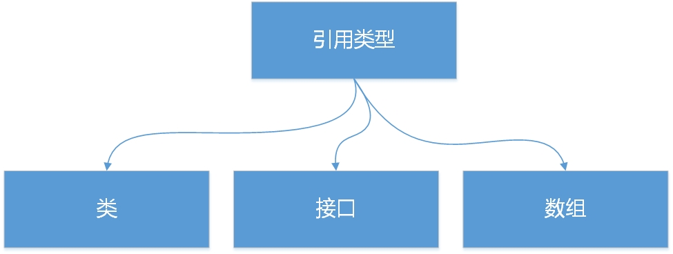
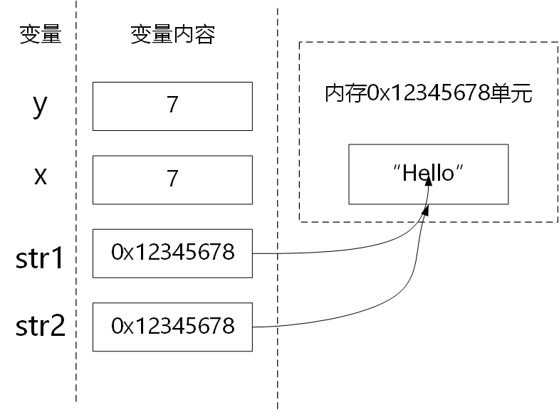
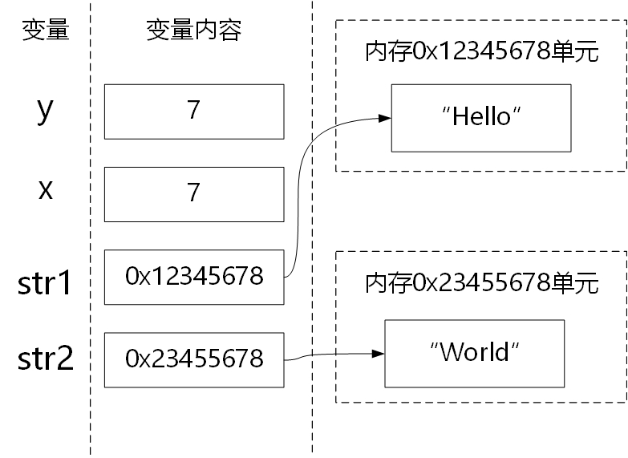

## 5.8 引用数据类型

在Java中除了8种基本数据类型外，其他数据类型全部都是引用（reference）数据类型，引用数据类型用了表示复杂数据类型，如图5-3所示，包含：类、接口和数组声明的数据类型。



图5-3　引用数据类型

提示 Java中的引用类型，相当于C等语言中指针（pointer）类型，引用事实上就是指针，是指向一个对象的内存地址。引用类型变量中保持的是指向对象的内存地址。很多资料上提到Java不支持指针，事实上是不支持指针计算，而指针类型还是保留了下来，只是在Java中称为引用类型。
引用数据类型示例如下：

```java
int x = 7;		①
int y = x;		②

String str1 = "Hello";	③
String str2 = str1;	④
str2 = "World";	⑤
```

上述代码声明了两个基本数据类型（int）和两个引用数据类型（String）。当程序执行完第②行代码后，x值为7，x赋值给y，这时y的值也是7，它们的保持方式如图5-4所示，x和y两个变量值都是7，但是它们之间是独立的，任何一个变化都不会影响另一个。

当程序执行完第③行时，字符串“Hello”对象被创建，保持到内存地址0x12345678中，str1是引用类型变量，它保存的是内存地址0x12345678，这个地址指向“Hello”对象。

当程序执行完第④行时，str1变量内容（0x12345678）被赋值给str2是引用类型变量，这样一来str1和str2保存了相同的内存地址，都指向“Hello”对象。见图5-4所示，此时str1和str2本质上是引用一个对象，通过任何一个引用都可以修改对象本身。

当程序执行完第⑤行时，字符串“World”对象被创建，保持到内存地址0x23455678中，地址保存到str2变量中，此时，str1和str2不再指向相同内存地址，见图5-5所示。



图5-4　引用数据类型赋值过程1



图5-5　引用数据类型赋值过程2