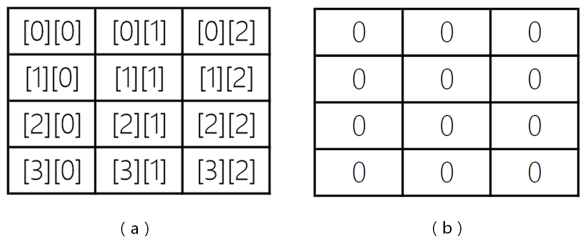

## 8.2 多维数组

当数组中每个元素又可以带有多个下标时，这种数组就是“多维数组”。本节重点介绍二维数组。

### 8.2.1 二维数组声明

Java中声明二维数组需要有两个中括号，具体有三种语法如下：


```java
元素数据类型[][] 数组变量名;
元素数据类型 数组变量名[][];
元素数据类型[] 数组变量名[];
```

三种形式中前两种比较好理解，最后一种形式看起来有些古怪。数组声明示例如下：
```java
int[][] array1;
int array1[][];
int[] array1[];
```
### 二维数组的初始化

二维数组的初始化也可以分为静态初始化和动态初始化。

#####1.  静态初始化

静态初始化示例如下：
```java
int intArray[][] = { { 1, 2, 3 }, { 11, 12, 13 }, { 21, 22, 23 }, { 31, 32, 33 } };
```
上述代码创建并初始化了一个4×3二维数组，理解Java中的多维数组应该从数组的数组的角度出发。首先将intArray看成是一个一维数组，它有4个元素，如图8-3所示，其中第1个元素是{ 1, 2, 3 }，第2个元素是{ 11, 12, 13 }，第3个元素是{ 21, 22, 23 }，第4个元素是{ 31, 32, 33 }。然后再分别考虑每一个元素，{ 1, 2, 3 }表示形式说明它是一个int类型的一维数组，其他3个元素也是一维int类型数组。


图8-3　intArray二维数组

**提示 严格意义上说Java中并不存在真正意义上的多维数组，只是一维数组，不过数组中的元素也是数组，以此类推三维数组就是数组的数组的数组了，例如{ { {1, 2}, {3} }, { {21}, {22, 23} } }表示一个三维数组。
**
#####2.  动态初始化

动态初始化二维数组语法如下：
```java
new 元素数据类型[高维数组长度] [低维数组长度] ;
```
高维数组就是最外面的数组，低维数组是每一个元素的数组。动态创建并初始化一个4×3二维数组示例代码如下：

int[][] intArray = new int[4][3];

二维数组的下标[4][3]有两个，前面的[4]是高维数组下标索引，后面的[3]是低维数组下标索引。4×3二维数组的每一个元素的下标索引，如图8-4(a)所示。由于低维数组是int类型，所以初始化完后所有元素全部是0，如图8-4(b)所示。




图8-4　二维数组动态初始化

二维数组示例如下：

```java
public class HelloWorld {

	public static void main(String[] args) {

		// 静态初始化二维数组
		int[][] intArray = { 
				{ 1, 2, 3 }, 
				{ 11, 12, 13 }, 
				{ 21, 22, 23 },
				{ 31, 32, 33 } };

		// 动态初始化二维数组
		double[][] doubleArray = new double[4][3];

		// 计算数组intArray元素的平方根，结果保存到doubleArray
		for (int i = 0; i < intArray.length; i++) {
			for (int j = 0; j < intArray[i].length; j++) {
				// 计算平方根
				doubleArray[i][j] = Math.sqrt(intArray[i][j]);			①
			}
		} 

		// 打印数组doubleArray
		for (int i = 0; i < doubleArray.length; i++) {
			for (int j = 0; j < doubleArray[i].length; j++) {
				System.out.printf("[%d][%d] = %f", i, j, doubleArray[i][j]);
				System.out.print('\t');
			}
			System.out.println();
		}
	}
}
```

代码第①行是中Math.sqrt(intArray[i][j])表达式是计算平方根，Math是java.lang包中提供的用于数学计算类，它提供很多常用的数学计算方法，sqrt是计算平方根，如取绝对值的abs、幂运算的pow等。

### 8.2.3 不规则数组

由于Java多维数组是数组的数组，因此会衍生出一种不规则数组，规则的4×3二维数组有12个元素，而不规则数组就不一定了。如下代码静态初始化了一个不规则数组。
```java
int intArray[][] = { { 1, 2 }, { 11 }, { 21, 22, 23 }, { 31, 32, 33 } };
```
高维数组是4个元素，但是低维数组元素个数不同，如图8-5所示，其中第1个数组有两个元素，第2个数组有1个元素，第3个数组有3个元素，第4个数组有3个元素。这就是不规则数组。


图8-5　不规则数组

动态初始化不规则数组比较麻烦，不能使用new int[4][3]语句，而是先初始化高维数组，然后再分别逐个初始化低维数组。代码如下：

```java
int intArray[][] = new int[4][]; //先初始化高维数组为4
//逐一初始化低维数组
intArray[0] = new int[2];
intArray[1] = new int[1];
intArray[2] = new int[3];
intArray[3] = new int[3];
```

从上述代码初始化数组完成之后，不是有12个元素而是9个元素，它们的下标索引如图8-6所示，可见其中下标[0][2]、[1][1]和[1][2]是不存在的，如果试图访问它们则会抛出下标越界异常。

图8-6　不规则数组访问

**提示 下标越界异常（ArrayIndexOutOfBoundsException）是试图访问不存在的下标时引发的。例如一个一维array数组如果有10个元素，那么表达式array[10]就会发生下标越界异常，这是因为数组下标是从0开始的，最后一个元素下标是数组长度减1，所以array[10]访问的元素是不存在的。
**
下面介绍一个不规则数组的示例：

```java
public class HelloWorld {

	public static void main(String[] args) {

		int intArray[][] = new int[4][]; //先初始化高维数组为4
		//逐一初始化低维数组
		intArray[0] = new int[2]; 
		intArray[1] = new int[1];
		intArray[2] = new int[3];
		intArray[3] = new int[3];
		
		//for循环遍历
		for (int i = 0; i < intArray.length; i++) {
			for (int j = 0; j < intArray[i].length; j++) {
				intArray[i][j] = i + j;
			}
		} 
		//for-each循环遍历
		for (int[] row : intArray) {			①
			for (int column : row) {		②		
				System.out.print(column);
				//在元素之间添加制表符，
				System.out.print('\t');
			}
			//一行元素打印完成后换行
			System.out.println();
		} 
		
		//System.out.println(intArray[0][2]); //发生运行期错误	③	
	}
}

```

不规则数组访问和遍历可以使用for和for-each循环，但要注意下标越界异常发生。上述代码第①行和第②行采用for-each循环遍历不规则数组，其中代码第①行for-each循环取出的数据是int数组，所以row类型是int[]。代码第②行for-each循环取出的数据是int数据，所以column的类型int。

另外，注意代码第③行试图访问intArray[0][2]元素，由于[0][2]不存在所以会发生下标越界异常。