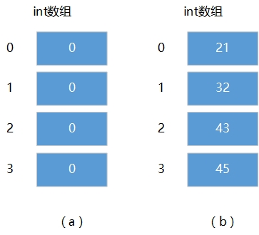
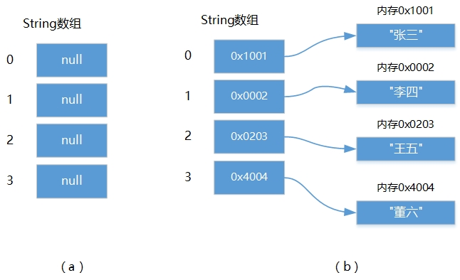

## 8.1 一维数组

当数组中每个元素都只带有一个下标时，这种数组就是“一维数组”。数组是引用数据类型，引用数据类型在使用之前一定要做两件事情：声明和初始化。

### 8.1.1 数组声明 {#-0}

数组的声明就宣告这个数组中元素类型，数组的变量名。
**
注意 数组声明完成后，数组的长度还不能确定，JVM（Java虚拟机）还没有给元素分配内存空间。
**
数组声明语法如下：

```java
元素数据类型[] 数组变量名;
元素数据类型 数组变量名[];
```

可见数组的声明有两种形式：一种是两个中括号（[]）跟在元素数据类型之后；另一种是两个中括号（[]）跟在变量名之后。

**提示 从面向对象角度看，Java更推荐采用第一种声明方式，因为它把“元素数据类型[]”看成是一个整体类型，即数组类型。而第二种是C语言数组声明方式。
**
数组声明示例如下：

```java
int intArray[];
float[] floatArray;
String strArray[];
Date[] dateArray;
```

### 8.1.2 数组初始化 {#-1}

声明完成就要对数组进行初始化，数组初始化的过程就是为数组每一个元素分配内存空间，并为每一个元素提供初始值。初始化之后数组的长度就确定下来不能再变化了。

**提示 有些计算机语言虽然提供了可变类型数组，它的长度是可变的，这种数组本质上是创建了一个新的数组对象，并非是原始数组的长度发生了变化。
**
数组初始化可以分为静态初始化和动态初始化。

#####1.  静态初始化

静态初始化就是将数组的元素放到大括号中，元素之间用逗号（,）分隔。示例代码如下：

```java
int[] intArray;
//静态初始化int数组
intArray = {21,32,43,45};

String[] strArray;
//静态初始化Stirng数组
strArray = {"张三","李四","王五","董六"};

//声明同时初始化数组
int intArray[] = {21,32,43,45};
String strArray[] = {"张三","李四","王五","董六"};

```
静态初始化是在已知数组的每一个元素内容情况下使用的。很多情况下数据是从数据库或网络中获得的，在编程时不知道元素有多少，更不知道元素的内容，此时可采用动态初始化。

#####2.  动态初始化

动态初始化使用new运算符分配指定长度的内存空间，语法如下：

```java
new 元素数据类型[数组长度] ;

```
示例代码如下：

```java
int intArray[];
// 动态初始化int数组
intArray = new int[4];	①
intArray[0] = 21;
intArray[1] = 32;
intArray[2] = 43;
intArray[3] = 45;	②

// 动态初始化String数组
String[] stringArray = new String[4];	③
// 初始化数组中元素
stringArray[0] = "张三";
stringArray[1] = "李四";
stringArray[2] = "王五";
stringArray[3] = "董六";		④

```

上述代码第①行和第③行通过new运算符分配了4个元素的内存空间。

**提示 new分配数组内存空间后，数组中的元素内容是什么呢？答案是数组类型的默认值，不同类型默认值是不同的，如表8-1所示。**

表8-1 数据类型默认值

| ** 基本类型   ** | **   默认值    ** |
| --- | --- |
| byte | 0 |
| short | 0 |
| int | 0 |
| long | 0L |
| float | 0.0f |
| double | 0.0d |
| char | &#039;\u0000&#039; |
| boolean | false |
| 引用 | null |

当代码第①行执行完成，intArray数组内容如图8-1(a)所示，intArray数组中的所有元素都是0，根据需要会动态添加元素内容，代码第②行执行完成，intArray数组内容如图8-1(b)所示。

当代码第③行执行完成，stringArray数组内容如图8-2(a)所示，stringArray数组中所有元素都是null，随着每一个元素被初始化和赋值，代码第④行执行完之后每个元素都有不同内容，这里需要注意的是引用类型数组，每一个元素保存都是指向实际对象的内存地址，如图8-2(b)所示，每个对象还需要创建和初始化过程，有关对象创建和初始化内容，将在后面章节详细介绍。



图8-1 intArray数组



图8-2 stringArray数组

### 8.1.3 案例：数组合并 {#-2}

数组长度是不可变，要想合并两个不同的数组，不能通过在一个数组的基础上追加另一个数组实现。需要创建一个新的数组，新数组长度是两个数组长度之和。然后再将两个数组的内容导入到新数组中。

下面具体看看实现代码：

```java
public class HelloWorld {

	public static void main(String[] args) {

		// 两个待合并数组
		int array1[] = { 20, 10, 50, 40, 30 };
		int array2[] = { 1, 2, 3 };

		// 动态初始化数组，设置数组的长度是array1和array2长度之和
		int array[] = new int[array1.length + array2.length];

		// 循环添加数组内容
		for (int i = 0; i < array.length; i++) {

			if (i < array1.length) { ①
				array[i] = array1[i];	②
			} else {
				array[i] = array2[i - array1.length];	③
			}
		}

		System.out.println("合并后:");
		for (int element : array) {
			System.out.printf("%d ", element);
		}

	}
}
```

上述代码第①行是判断当前循环变量i是否小于array1.length，在此条件下将array1数组内容导入新数组，见代码第②行。当array1数组内容导入完成后，再通过代码第③行将另一个数组array2导入到新数组，其中array2下标应该是i - array1.length。